# Primera pre-entrega de proyecto backend

### Alumno: Renier Pérez

### Comisión: 53150

```
En la siguiente entrega podemos crear productos desde Postman, luego editarlos, borrarlos y tambien obtener productos creados previamente.

Tambien agregar esos productos a diferentes carros mediante su ID y consultar el ID del producto que se encuentra en el carro.
```

```
Todo eso lo obtendremos mediante dos archivos JSON, uno es el products.json y el otro es el carts.json
```

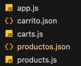

```
En el siguiente ejemplo agregue una camisa y una taza usando el metodo POST desde postman con su respectiva información
```

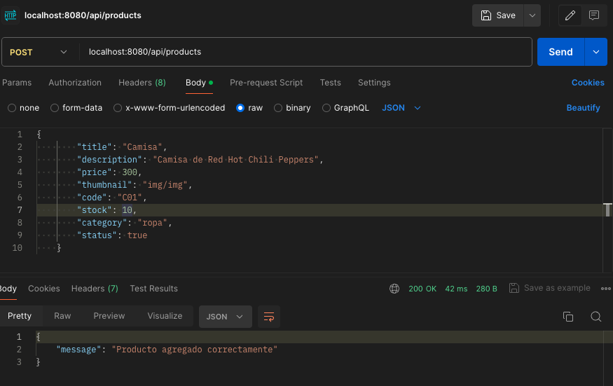
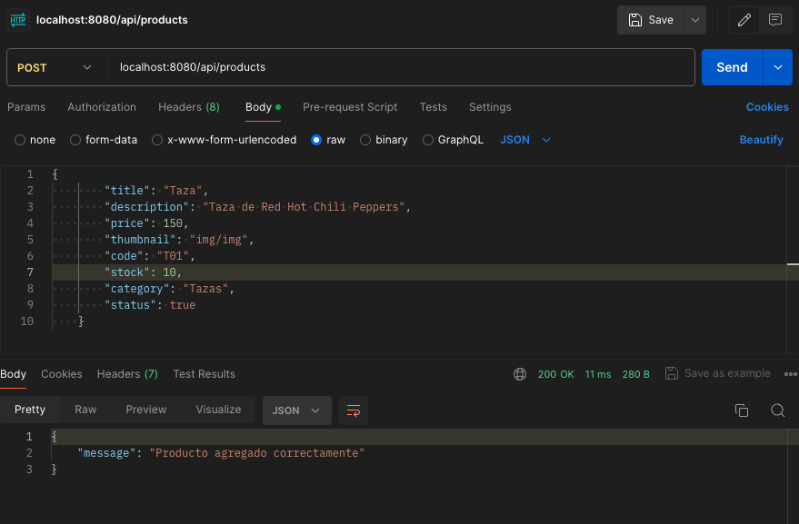

```
Aquí podemos ver los dos productos guardados en su correspondiente JSON
```

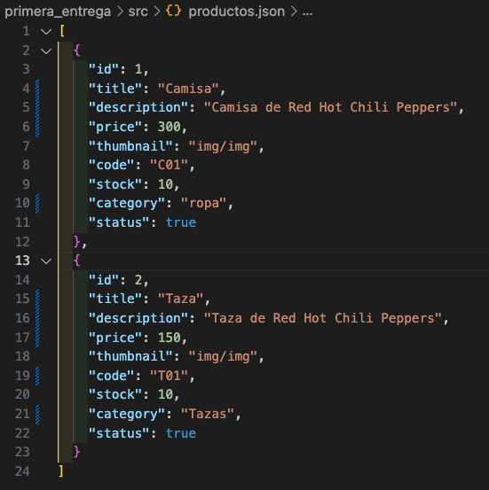

```
Ahora usando el metodo PUT desde postman voy a modificar el stock de uno de los productos
guardados previamente
```

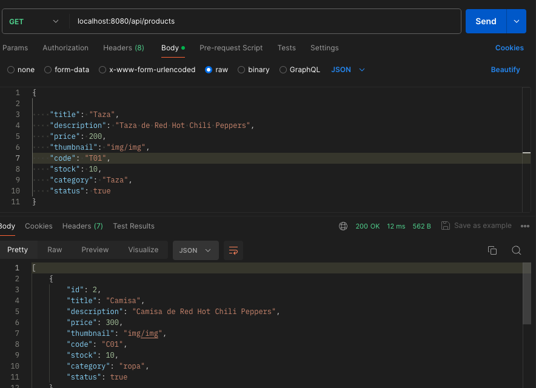
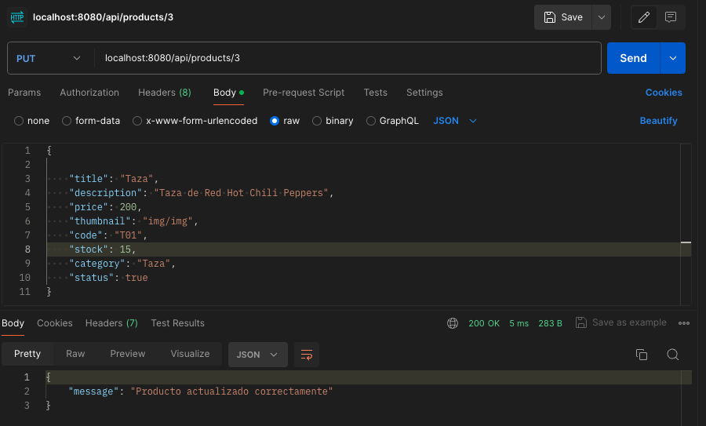

```
Ahora usando el metodo DELETE desde postman borrare el segundo producto que habia creado
```

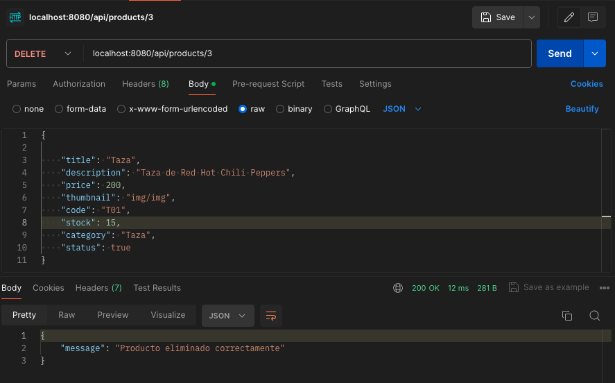
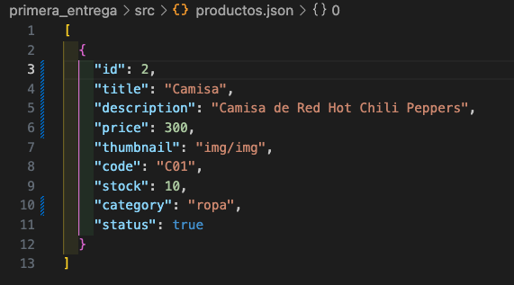

```
Ahora entrando en el apartado de los carros voy a asignar el producto que quedo
creado que sería el producto con id: 1 al carrito con id: 1 mediante
el metodo POST desde postman
```

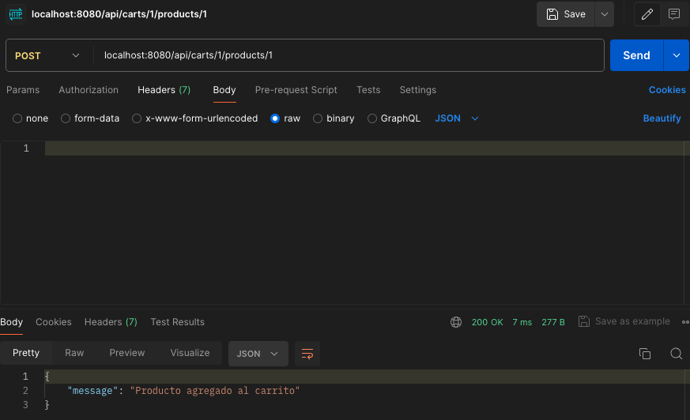

```
Ahora despues de agregar varias veces el mismo producto y revisando el respectivo JSON podemos
ver que aparece su id y la cantidad
```

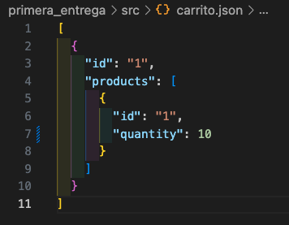

```
Ahora haciendo el metod get al carrito 1 desde postman podemos ver la informacion dentro del
mismo
```

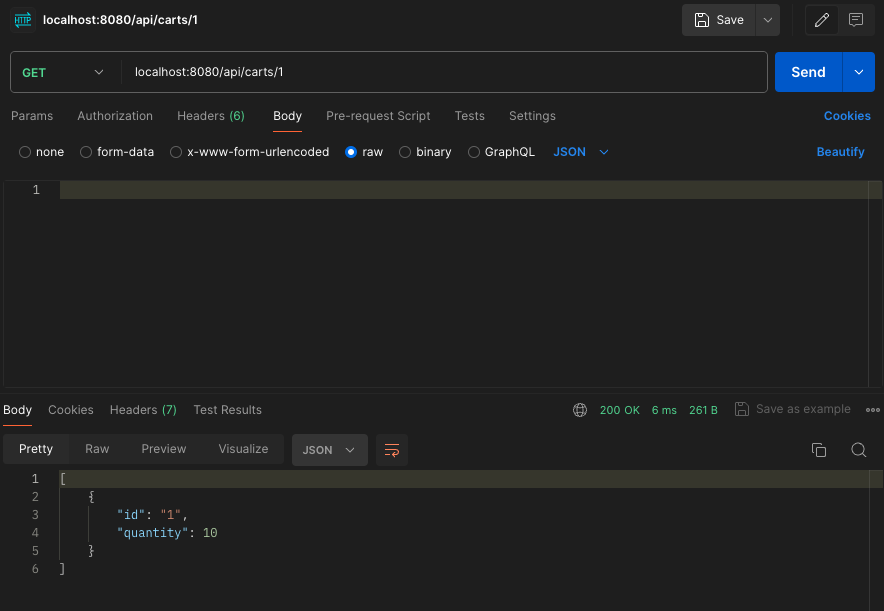
